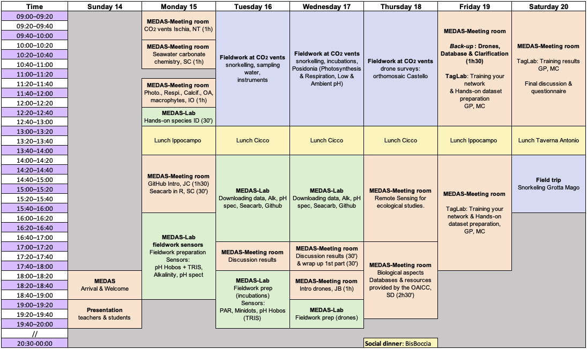
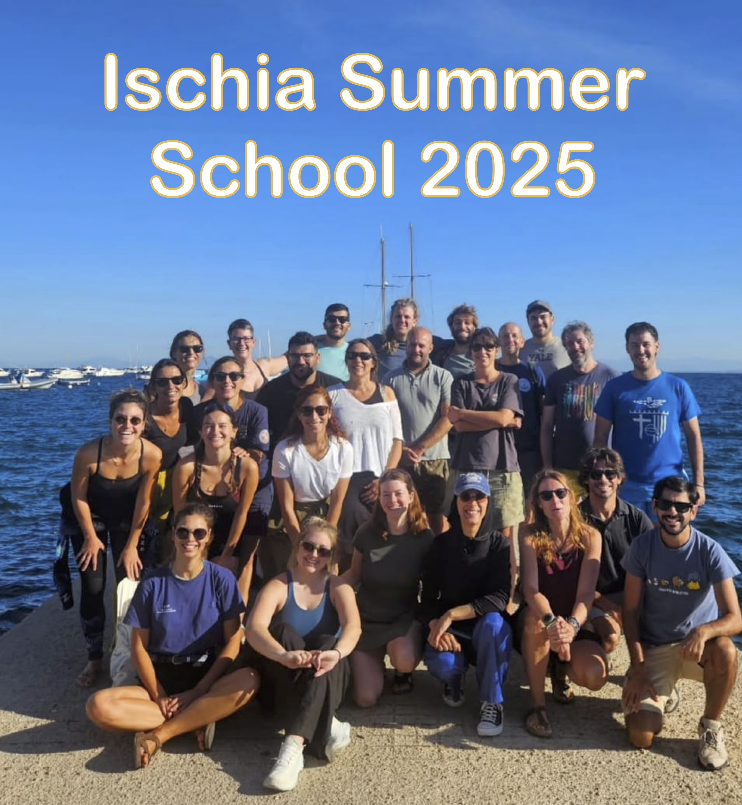

---

## **Course Overview**

The PulseOcean Euromarine Summer School is a pioneering training initiative tackling critical
marine challenges, including climate change, blue carbon, benthic biodiversity, and the
application of emerging image technologies and AI-based analysis, using the CO₂ vents along
the Castello Aragonese in Ischia as a marine natural laboratory.
Tailored for PhD students and early-career researchers, the course combines lectures, fieldwork
(including snorkeling) at the submarine CO₂ vents, and lab-based projects, providing hands-on
experience on seawater chemistry and ecological methods, AI-based image analysis and
processing, drone surveys and photogrammetry, and data science tools (R and GitHub).
This interdisciplinary program fosters critical thinking, career development, and collaboration
while promoting open and reproducible science. It aligns with the UN Decade of Ocean Science
and Sustainable Development Goals (SDGs), particularly SDG 4 (Quality and Education), SDG
13 (Climate Action), SDG 14 (Life Below Water), and SDG 5 (Gender Equality). PulseOcean is
committed to research excellence and knowledge exchange across Europe.

---

## **Schedule**

---

## **Documents**

All course materials will be organized and stored here by instructor for easy access.

1. [📁 **Ocean Acidification**](https://github.com/nuriateixidolab/nuriateixidolab.github.io/tree/main/Documents/1_ocean_acidification)  
2. [📁 **GitHub**](https://github.com/nuriateixidolab/nuriateixidolab.github.io/tree/main/Documents/Jeremy%20Carlot)  
3. [📁 **Databases**](https://github.com/nuriateixidolab/nuriateixidolab.github.io/tree/main/Documents/3_databases)  
4. [📁 **Drones**](https://github.com/nuriateixidolab/nuriateixidolab.github.io/tree/main/Documents/4_drones)  
5. [📁 **TagLab**](https://github.com/nuriateixidolab/nuriateixidolab.github.io/tree/main/Documents/5_taglab)  

---

## **Pictures**

Here you can find a selection of the pictures, and you can find the whole folder [here](https://github.com/nuriateixidolab/nuriateixidolab.github.io/tree/main/pictures)

  
  
  
  
  
  
  
  
  
  
  
  
  
  
  
  
  
  
  
  
  
  
  
  
  

