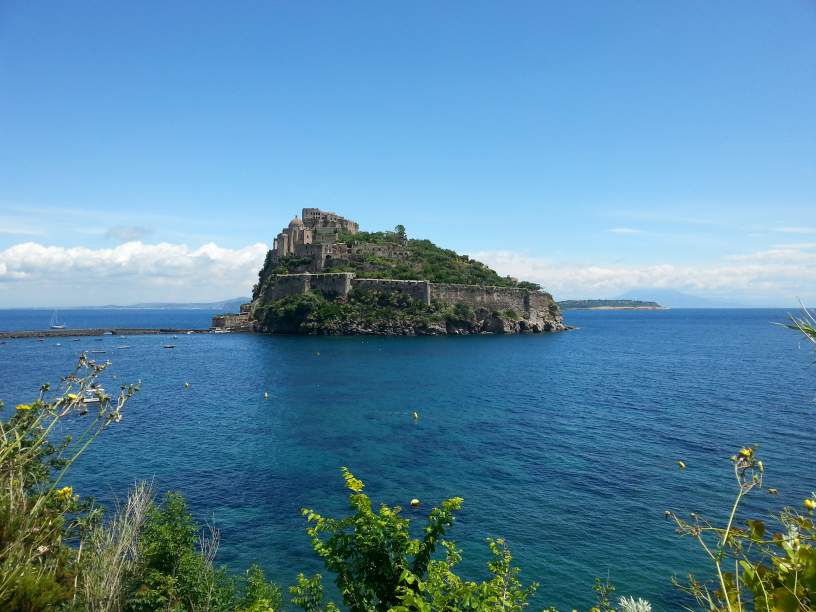

---

## **Course Overview**

The PulseOcean Euromarine Summer School is a pioneering training initiative tackling critical
marine challenges, including climate change, blue carbon, benthic biodiversity, and the
application of emerging image technologies and AI-based analysis, using the CO₂ vents along
the Castello Aragonese in Ischia as a marine natural laboratory.
Tailored for PhD students and early-career researchers, the course combines lectures, fieldwork
(including snorkeling) at the submarine CO₂ vents, and lab-based projects, providing hands-on
experience on seawater chemistry and ecological methods, AI-based image analysis and
processing, drone surveys and photogrammetry, and data science tools (R and GitHub).
This interdisciplinary program fosters critical thinking, career development, and collaboration
while promoting open and reproducible science. It aligns with the UN Decade of Ocean Science
and Sustainable Development Goals (SDGs), particularly SDG 4 (Quality and Education), SDG
13 (Climate Action), SDG 14 (Life Below Water), and SDG 5 (Gender Equality). PulseOcean is
committed to research excellence and knowledge exchange across Europe.

---

## **Schedule**

| Time          | Sunday 14                           | Monday 15                                            | Tuesday 16                                             | Wednesday 17                                          | Thursday 18                                            | Friday 19                                              | Saturday 20                           |
|---------------|-----------------------------------|-----------------------------------------------------|--------------------------------------------------------|-------------------------------------------------------|--------------------------------------------------------|---------------------------------------------------------|-------------------------------------|
| 08:30-09:30h  |                                   | **MEDAS-Meeting room** CO₂ vents Ischia           | **Fieldwork at CO₂ vents** (snorkelling, sampling water, instruments) | **Fieldwork at CO₂ vents** (drone surveys; orthomosaic Castello) | **MEDAS-Meeting room** TagLab: Training your network & Hands-on dataset preparation | **MEDAS-Meeting room** TagLab: Training your network & Hands-on dataset preparation | **MEDAS-Meeting room** TagLab: training results |
| 09:35-10:30   |                                   | ↳                                                   | ↳                                                      | ↳                                                     | ↳                                                        | ↳                                                         | ↳                                    | ↳
| 10:45-12:00   |                                   | ↳                                                   | ↳                                                        | ↳                                                       | ↳                                                        | ↳                                                         | ↳                                     | ↳
| 12:00-12:30   |                                   | ↳                                                   | ↳                                                       | ↳                                                      | ↳                                                        | ↳                                                        | ↳                                     | ↳
| 12:30-14:00   |                                   | **Lunch**                                                     | **Lunch**                                                       | **Lunch**                                                      | **Lunch**                                              | **Lunch**                                                        | **Lunch**                                    | **Lunch**
| 14:00-16:00   |                                   | **MEDAS-Meeting room** Introduction to GitHub R Package Seacarb | **MEDAS-Lab** Downloading data Seacarb Sharing with Github | **MEDAS-Lab** Downloading data Seacarb Sharing with Github | **MEDAS-Meeting room** Wrap up 1st part Photogrammetry with aerial images | **MEDAS-Meeting room** TagLab: Training your network & Hands-on dataset preparation | **MEDAS-Meeting room** Final discussion & questionnaire | ↳
| 16:05-17:00   |                                   | **MEDAS-Lab** Fieldwork preparation Sensors + Alkalinity | **MEDAS-Meeting room** Discussion results           | **MEDAS-Meeting room** Discussion results (30 min) | **MEDAS-Meeting room** Remote Sensing for ecological studies | ↳                                                        |                                     | 
| 17:15-19:00   | **MEDAS** Arrival & Welcome Presentation teachers & students | ↳                                                     | **MEDAS-Lab** Fieldwork prep (incubations)           | **MEDAS-Meeting room** Biological aspects Databases and resources provided by the OAI CC | ↳                                                       | ↳                                                        |                                     |
| 19:00-20:00   |                                   |                                                     |                                                        | **Fieldwork prep (drones)**                             |                                                        |                                                         |                                     |

---

## **Documents**

All course materials will be organized and stored here by instructor for easy access.

[📁 **Jordi Boada**](https://github.com/nuriateixidolab/nuriateixidolab.github.io/tree/main/Documents/Jordi%20Boada)  
[📁 **Jérémy Carlot**](https://github.com/nuriateixidolab/nuriateixidolab.github.io/tree/main/Documents/Jeremy%20Carlot)  
[📁 **Antonia Chiarore**](https://github.com/nuriateixidolab/nuriateixidolab.github.io/tree/main/Documents/Antonia%20Chiarore)  
[📁 **Steeve Comeau**](https://github.com/nuriateixidolab/nuriateixidolab.github.io/tree/main/Documents/Steeve%20Comeau)  
[📁 **Massimiliano Corsini**](https://github.com/nuriateixidolab/nuriateixidolab.github.io/tree/main/Documents/Massimiliano%20Corsini)  
[📁 **Sam Dupont**](https://github.com/nuriateixidolab/nuriateixidolab.github.io/tree/main/Documents/Sam%20Dupont)  
[📁 **Valerio Mazella**](https://github.com/nuriateixidolab/nuriateixidolab.github.io/tree/main/Documents/Valerio%20Mazella)  
[📁 **Alice Mirasole**](https://github.com/nuriateixidolab/nuriateixidolab.github.io/tree/main/Documents/Alice%20Mirasole)  
[📁 **Irene Olive**](https://github.com/nuriateixidolab/nuriateixidolab.github.io/tree/main/Documents/Irene%20Olive)  
[📁 **Gaia Pavoni**](https://github.com/nuriateixidolab/nuriateixidolab.github.io/tree/main/Documents/Gaia%20Pavoni)  
[📁 **Núria Teixidó**](https://github.com/nuriateixidolab/nuriateixidolab.github.io/tree/main/Documents/Nuria%20Teixido)  